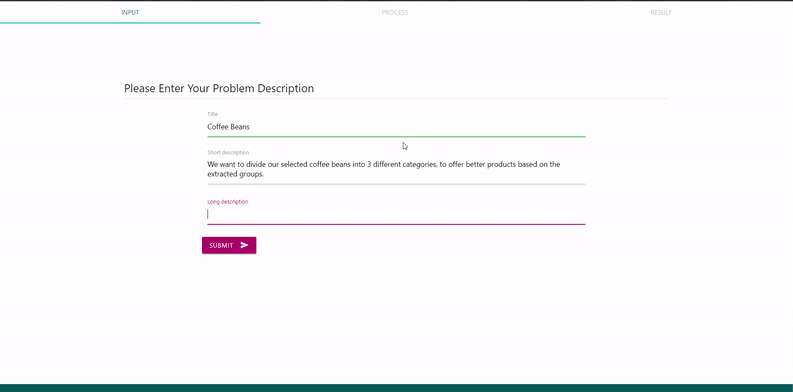

# Recommender-System

The developed recommender system is part of our master thesis ([download](static//thesis/thesis.pdf)). Based on the
challenge that Data Science is an highly interdisciplinary field of research. This area combines complex methods of 
statistics, mathematics, computer science and machine learning. Nevertheless, the handling of domain-specific data
requires comprehensive domain knowledge. The developed application tries to close the gap between data scientist and 
domain experts. On the one hand the access to the domain specific topic is simplified for the data scientist and on
the other hand the domain expert has an first point of reference for a more comprehensive discussion with the data scientist.

## How to Use? 
The only thing you need to do is to provide a short description as well as a title and submit it (long description is optional).

## Documentation
A detailed documentation about all the classes, functions, interfaces and the project structure you can find here: 
<a href="">documentation</a>

## Installation

Basically,  you have to ways to install the recommendation system: 

1. First you can use the docker image (__recommended__): <a href = "">rs_export.tar</a>
2. Second you can set up a python environment and run the program via _app.py_

### Notes an pre Requirements

#### Pre Requirements
- Docker version: 18.09.2
- Python version: 3.6.7
#### Notes
- The docker container as well as the requirements.txt are build on TensorFlow 1.13.0 without(!) GPU support
- If you want GPU support you need to build your own docker image and change the requirements.txt
- All squared brackets [] in the following code are placeholder and are not part of the command!

### Using the Docker Container
The docker consists of all necessary files, libraries and dependencies to start the software - so you don't need to install them. 
Before you start, make sure that you have installed docker (https://docs.docker.com/docker-for-windows/install/). 

1. Follow the steps as described here: <a href="https://docs.docker.com/docker-for-windows/install/">docker installation</a> to install Docker. 
2. Open the terminal and load the docker image: ```docker load --input [PATH TO rs_export.tar] ```
3. Create a docker container with the name "rs" and run it on port 80: ```docker run --name rs  -p 80:80 rs```

#### Some other use full commands
1. Stop a running container: ```docker stop [NAME OF CONTAINER]``` 
2. Start the docker container again: ```docker start rs```

### Installation via pip (or conda)
If you prefer not to use a docker container, you can also install the software to your local python environment. 
We recommend to create a new environment via venv or conda. All required packages are listed in the requirements.txt file. 
__Please make sure that you use at least Python 3.6.7__

1. First update pip: ``pip install --upgrade pip``
2. Install the packages via pip: `` pip install -r [PATH TO requirements.txt]`` 
3. After the installation completed run the following command in your python environment to install the pke package: 
    ``pip install git+https://github.com/boudinfl/pke.git``
4. Download all necessary nltk packages: 
    * First type in your terminal (with you corresponding python environment): ``python``
    * Type ``import nltk``
    * Type ``nltk.download("all")``
    * Exit python with: ``exit()``
5. Now you can run the app in you python environment by using following command: ``python [PATH TO app.py]``


## Building a Docker Image
The implemented software may be used for later research projects. If you want to build your own docker image you can use
the docker file attached to the code but you can also install the packages directly to you local python distribution if you prefer.
But make sure you copy the docker files outside of the Recommender-System project to build the container. 

The directory structure need to be as followed: 

```
- Dockerfile
- .dockerignore
- Recommender-System
    - data
    - models
    - ...
```

1. Open a terminal and navigate yourself to the directory where you copied the Dockerfile: ``cd [PATH TO Dockerfile]``
2. Build the image: ```docker build ./ -t rs```
3. Build the container and test it: ``docker run --name rs  -p 80:80 rs``
4. Now you can start and run the docker as usual


## Setting up Pycharm 
The whole software engineering process was carried out in PyCharm. Use the following steps if you want to set up the IDE
as we did. 

### Arguments for Pycharm-File-Watcher:
 
 Programm: ```/Library/Ruby/Gems/2.3.0/gems/sass-3.7.2/bin/sass```
 <br/>
 Arguments: ```--no-cache --update $FileName$:../css/$FileNameWithoutExtension$.css```
 <br/>
 Out-Path: ```../css/$FileNameWithoutExtension$.css:../css/$FileNameWithoutExtension$.css.map```
 
### Configuring Flask Configuration

To edit your flask configuration go to: 

1. Run
2. Edit Configurations
3. Add Flask Configuration (Right corner on the top)
4. Change _Target_: ```/PycharmProjects/Recommender-System/app.py```
5. Change _Flask Env_: ```development```
6. Change _Python Interpreter_: ```Project Default..```
7. Activate the Debug mode (Autoreload after changes - only for py files as i noticed.)
8. Run the Application with the flask configuration (On the top left corner where the symbols for run, debug, etc. are)

### Selective Merge using PyCharm
1. Go to Version Control Tab
2. Go to Log
3. Search for the commit you want to merge into your branch and right-click __chery-pick__
4. Commit